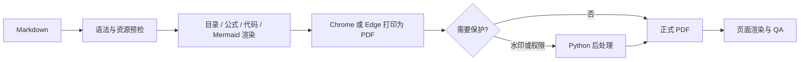

# md2pdf Skill

[](https://github.com/huoxingbiji/md2pdf-skill/releases/tag/v1.2.0)
[](https://github.com/huoxingbiji/md2pdf-skill/actions/workflows/ci.yml)
[](LICENSE)

一个面向中文技术文档、方案、报告和流程图文档的 Markdown → PDF 工具，同时也是可供 Codex 自动调用的本地 Skill。

它关注的不只是“能生成 PDF”，还包括公式、流程图、代码、目录跳转、表格分页、水印、权限保护以及生成后的页面质检。

> English summary: a quality-gated Markdown-to-PDF CLI and Codex Skill with Chinese typography, clickable TOC, syntax highlighting, KaTeX, Mermaid, watermarking and rendered-page QA.

## 它能解决什么问题

普通的 Markdown 转 PDF 工具经常在交付文档中遇到这些问题：

- 中文字体、行距和标题层级不协调；
- LaTeX 公式变成原始文本，或者字体没有加载完成；
- Mermaid 图太小、被截断，复杂流程图没有独占页面；
- 代码块只有单一颜色，难以阅读；
- 目录只是文本，点击后不能跳到对应章节；
- 长表格跨页后表头丢失，或整页出现异常留白；
- 水印只是浮层，容易在普通编辑器中直接删除；
- 文件虽然生成成功，却没有经过逐页渲染检查。

md2pdf Skill 将这些环节放在同一条可复检的转换链路中，并默认保持源 Markdown 不变。

## 功能一览

| 能力 | 说明 |
|---|---|
| 中文排版 | A4 页面、中文优先字体、统一标题、段落、引用和表格样式 |
| 可点击目录 | 按标题生成目录和稳定锚点，支持中文、重复标题和 Setext 标题 |
| 代码高亮 | 使用围栏声明的语言；未声明时谨慎自动识别；支持关闭 |
| KaTeX 公式 | 渲染块级和可信的行内公式，解析失败时停止交付 |
| Mermaid 矢量图 | 输出 SVG，并按复杂度自动选择正文、整页或横向整页布局 |
| 图片与表格 | 支持相对路径图片、长表格跨页和重复表头 |
| 安全修复 | 只在转换内存中修复明确安全的 Markdown 加粗空格问题 |
| 水印 | 将重复水印合并到每页内容流，而不是只添加可见浮层 |
| 权限保护 | 可用 AES-256 所有者密码限制普通阅读器修改、批注和页面重组 |
| 页面质检 | 渲染所有或抽样页面，检查乱码、空白页、原始标记和内部链接 |

## 转换流程



## 快速开始

### 环境要求

- Node.js `22.12.0` 或更高版本，推荐 Node.js 24；
- Chrome、Edge，或由 Puppeteer 安装的兼容浏览器；
- Python 3.11 或更高版本：仅水印、权限保护和 QA 脚本需要；
- Windows、macOS 或 Linux。

### 下载和安装

```bash
git clone https://github.com/huoxingbiji/md2pdf-skill.git
cd md2pdf-skill
npm ci
python -m pip install -r requirements.txt
```

如果只需要基础 Markdown → PDF，不使用水印、权限保护和 Python QA，可以暂不安装 `requirements.txt` 中的依赖。

### 生成第一份 PDF

```bash
node convert.mjs "example.md" "example.pdf" --toc off
```

加入可点击目录：

```bash
node convert.mjs "example.md" "example.pdf" --toc on
```

转换日志会报告标题、代码块、Mermaid、公式、目录链接、高亮片段、水印和加密状态。

## 作为 Codex Skill 使用

将仓库放在 Codex 的个人 Skill 目录中，并安装 Node.js 依赖。

Windows 示例：

```powershell
git clone https://github.com/huoxingbiji/md2pdf-skill.git "C:\Users\<用户名>\.codex\skills\md2pdf"
Set-Location "C:\Users\<用户名>\.codex\skills\md2pdf"
npm ci
python -m pip install -r requirements.txt
```

macOS / Linux 示例：

```bash
git clone https://github.com/huoxingbiji/md2pdf-skill.git ~/.codex/skills/md2pdf
cd ~/.codex/skills/md2pdf
npm ci
python3 -m pip install -r requirements.txt
```

然后可以在 Codex 中直接表达目标，例如：

```text
$md2pdf 把主目录中的产品方案.md 转成 PDF，不需要目录。
```

```text
$md2pdf 把这份报告转成 PDF，增加可点击目录，并检查所有公式和流程图。
```

```text
$md2pdf 给 PDF 增加 ACME 水印和修改权限保护，所有者密码从环境变量读取。
```

Skill 会先检查源文件，再转换、渲染页面并复检；除非明确要求修改源文件，安全修复和分页调整只作用于临时内容。

## 常用命令

### 自动放入日期文件夹

```bash
node convert.mjs "report.md" --date-folder --toc off
```

输出示例：`2026-09-11/report.pdf`。

### 目录、公式和高亮

```bash
node convert.mjs "report.md" "report.pdf" \
  --toc on \
  --math auto \
  --highlight auto
```

PowerShell 可将续行符 `\` 改为反引号，或者把命令写在一行中。

### 复杂 Mermaid 独占整页

全局设置：

```bash
node convert.mjs "architecture.md" "architecture.pdf" --diagram full-page
```

仅对单个图设置：

````markdown

````

### 水印与所有者密码

PowerShell：

```powershell
$env:MD2PDF_OWNER_PASSWORD = '<通过安全渠道保存的密码>'
node .\convert.mjs input.md output.pdf --watermark "ACME" --owner-password-env MD2PDF_OWNER_PASSWORD
Remove-Item Env:MD2PDF_OWNER_PASSWORD
```

Bash：

```bash
export MD2PDF_OWNER_PASSWORD='<通过安全渠道保存的密码>'
node ./convert.mjs input.md output.pdf --watermark "ACME" --owner-password-env MD2PDF_OWNER_PASSWORD
unset MD2PDF_OWNER_PASSWORD
```

不要把真实密码直接写入命令参数、Markdown、脚本或 Git 仓库。

> PDF 权限控制主要用于提高普通编辑行为的门槛，不能从密码学上保证专业工具永远无法移除水印或重建页面。

## 页面质检

生成 PDF 后，可渲染所有页面并生成联系表：

```bash
python scripts/qa_pdf.py output.pdf --out-dir tmp/pdfs/qa --render all
```

对于生成了目录的文档，验证 PDF 中确实存在内部跳转链接：

```bash
python scripts/qa_pdf.py output.pdf \
  --out-dir tmp/pdfs/qa \
  --render all \
  --expect-internal-links
```

没有内部链接时，`--expect-internal-links` 会返回失败。`--strict` 还会把异常纸张、低文本页和原始 Markdown/LaTeX 标记作为失败处理；代码示例中可能合法包含这些标记，因此严格模式结果仍需结合源文档判断。

## Markdown 编写建议

- 为代码块声明语言，例如 `python`、`sql`、`javascript`、`powershell`；
- 复杂 Mermaid 使用 `full-page`，普通小图使用 `normal`；
- 图片使用相对于 Markdown 文件的路径，并放在 Markdown 所在目录或子目录；
- 块公式使用成对的 `$$`；
- 不要依赖大量原始 HTML 或固定像素尺寸控制分页；
- 需要目录时显式使用 `--toc on`，不需要时使用 `--toc off`。

完整写法请参阅 [Markdown 编写指南](docs/MARKDOWN_GUIDE.md)。

## 文档导航

- [安装与升级](docs/INSTALLATION.md)
- [完整 CLI 参考](docs/CLI.md)
- [Markdown 编写指南](docs/MARKDOWN_GUIDE.md)
- [常见问题与排错](docs/TROUBLESHOOTING.md)
- [贡献指南](CONTRIBUTING.md)
- [社区行为准则](CODE_OF_CONDUCT.md)
- [安全政策](SECURITY.md)
- [版本记录](CHANGELOG.md)
- [第三方组件与许可证](THIRD_PARTY_NOTICES.md)

## 项目结构

```text
md2pdf-skill/
├── SKILL.md                    Codex Skill 入口说明
├── convert.mjs                 Markdown → PDF 主转换器
├── mermaid.min.js              离线 Mermaid 浏览器构建
├── scripts/
│   ├── postprocess_pdf.py      水印和权限后处理
│   ├── qa_pdf.py               PDF 页面与链接质检
│   └── smoke_test.mjs          跨平台冒烟测试
├── references/options.md       Skill 高级参数参考
├── tests/fixtures/             回归测试文档与本地资源
└── docs/                       面向使用者的详细文档
```

## 隐私与安全边界

- 转换过程在本地运行；安装完成后，转换器不依赖远程 CDN；
- 浏览器请求被限制为临时本地服务、内嵌数据和 KaTeX 字体；
- 相对图片只允许从 Markdown 所在目录及其子目录读取；
- 原始 HTML 可能影响最终版式，只转换你信任或已经审阅的 Markdown；
- 所有者密码通过环境变量传递，不会由工具主动写入文档。

安全问题请不要直接公开包含利用细节的 Issue，参阅 [SECURITY.md](SECURITY.md)。

## 开发与贡献

```bash
npm ci
npm test
```

欢迎提交问题、使用场景、兼容性反馈和 Pull Request。修改转换器时，请同时补充相应测试样例，并确认源 Markdown 不被转换过程修改。

## 许可证

项目自身代码采用 [MIT License](LICENSE)。第三方组件使用各自许可证，详见 [THIRD_PARTY_NOTICES.md](THIRD_PARTY_NOTICES.md)。
