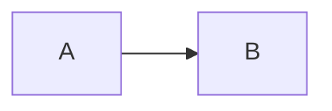

# CLI 完整参考

## 命令格式

```text
node convert.mjs <input.md> [output.pdf] [options]
```

输入文件必须是 `.md`。显式提供输出路径时，扩展名必须是 `.pdf`。

## 参数

| 参数 | 默认值 | 说明 |
|---|---:|---|
| `--toc off\|on\|auto` | `off` | 关闭、强制生成或按长度自动生成可点击目录 |
| `--highlight auto\|off` | `auto` | 启用语言识别和语法着色，或按纯文本显示代码 |
| `--math auto\|off` | `auto` | 启用 KaTeX 公式识别，或保留 `$` 文本 |
| `--repair-markdown safe\|off` | `safe` | 修复明确安全的加粗标记内部空格 |
| `--diagram auto\|normal\|full-page` | `auto` | Mermaid 自适应、普通正文或整页模式 |
| `--date-folder` | 关闭 | 未给出输出路径时，写入源文件旁的当天日期文件夹 |
| `--watermark <text>` | 无 | 向每页内容流合并重复水印 |
| `--watermark-opacity <0..1>` | `0.12` | 水印透明度 |
| `--watermark-angle <-180..180>` | `-35` | 水印旋转角度 |
| `--owner-password-env <name>` | 无 | 从指定环境变量读取 PDF 所有者密码 |
| `--header-footer on\|off` | `on` | 显示或隐藏文档标题页眉和页码页脚 |
| `--help` | — | 显示帮助 |

## 输出路径规则

1. 指定 `output.pdf` 时始终使用该路径；
2. 未指定输出路径且使用 `--date-folder` 时，输出到 `源目录/YYYY-MM-DD/同名.pdf`；
3. 两者都未指定时，输出到源文件旁的同名 PDF；
4. 重新生成时覆盖同名文件；
5. Windows 上目标文件被阅读器占用时，回退为 `_new.pdf`，并在日志中提示真实路径。

## 目录模式

```bash
node convert.mjs report.md report.pdf --toc on
```

- `off`：不临时添加目录；源 Markdown 自带的内容保持不变；
- `on`：文档没有目录标题时临时插入目录；
- `auto`：文档超过 500 行且没有目录时临时插入目录。

生成目录会为标题建立稳定锚点。重复标题依次添加 `-2`、`-3` 等后缀；目录条目在 PDF 中保存为内部链接注释。

## 代码高亮

```bash
node convert.mjs report.md report.pdf --highlight auto
```

显式语言优先，例如：

````markdown
```python
print("hello")
```
````

常用别名会自动规范化，例如 `py`、`js`、`ts`、`ps1`、`sh` 和 `yml`。未声明语言时，只在内容长度和识别置信度达到门槛后自动着色。未知语言会保留代码内容，并按纯文本渲染。

## 公式

```bash
node convert.mjs metrics.md metrics.pdf --math auto
```

块公式使用 `$$...$$`。行内公式只在内容看起来确实是数学表达式时处理，降低货币符号等普通文本被误识别的概率。

未配对的 `$$` 或 KaTeX 解析错误会停止转换。

## Mermaid 布局

```bash
node convert.mjs workflow.md workflow.pdf --diagram auto
```

- `auto`：按 SVG 尺寸、宽高比和节点数选择；
- `normal`：所有图都作为普通正文内容；
- `full-page`：所有图都独占页面，宽图自动使用 A4 横向页。

单个图可在围栏信息中覆盖全局模式：

````markdown

````

## 水印和权限保护

所有者密码只允许通过环境变量读取：

```powershell
$env:MD2PDF_OWNER_PASSWORD = '<密码>'
node .\convert.mjs input.md output.pdf `
  --watermark "ACME" `
  --watermark-opacity 0.12 `
  --watermark-angle -35 `
  --owner-password-env MD2PDF_OWNER_PASSWORD
Remove-Item Env:MD2PDF_OWNER_PASSWORD
```

默认允许打开、打印和复制，但限制普通阅读器中的修改、批注、表单填写和页面重组。

## 环境变量

| 环境变量 | 用途 |
|---|---|
| `MD2PDF_BROWSER` | 指定 Chrome 或 Edge 可执行文件 |
| `MD2PDF_PYTHON` | 指定水印和加密后处理使用的 Python |
| 用户自定义名称 | 通过 `--owner-password-env` 指定所有者密码变量名 |

## 日志与失败条件

成功日志包含：

- 文档标题和行数；
- 标题、代码块、Mermaid 和公式数量；
- 是否添加目录及内部链接数量；
- 高亮代码块和着色片段数量；
- 水印、加密和最终文件路径。

以下情况会返回非零退出码：

- 输入或输出扩展名不正确；
- 代码围栏或 `$$` 未闭合；
- KaTeX 或 Mermaid 渲染失败；
- 图片无法加载；
- 生成的文内链接没有对应标题；
- 浏览器、Python 或后处理依赖不可用；
- 源 Markdown 在转换期间发生变化。

## QA 命令

```text
python scripts/qa_pdf.py <input.pdf> --out-dir <dir> [options]
```

| 参数 | 默认值 | 说明 |
|---|---:|---|
| `--render all\|sample\|none` | `sample` | 渲染全部、代表页面或不渲染 |
| `--dpi <number>` | `100` | PNG 渲染分辨率 |
| `--strict` | 关闭 | 原始标记、低文本页或非 A4 页面视为失败 |
| `--expect-internal-links` | 关闭 | PDF 没有内部链接注释时直接失败 |

QA 会输出 JSON 报告、页面 PNG 和联系表。报告中的原始标记可能来自合法代码示例，不能脱离源文档机械判断。
