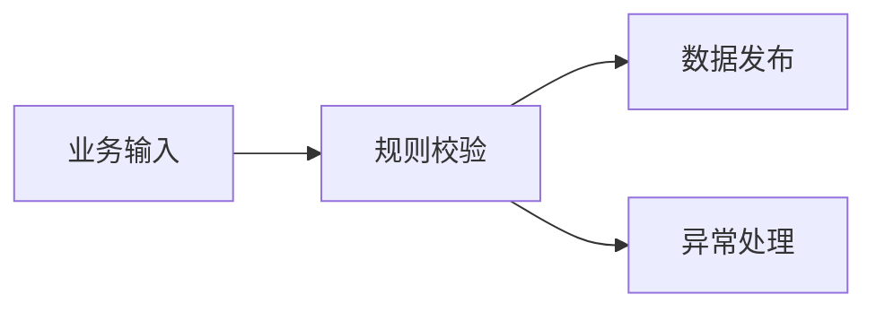
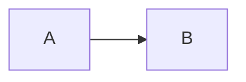
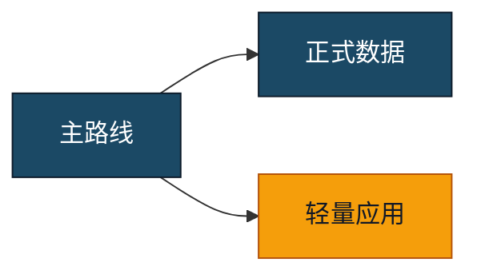

# Markdown 编写指南

这份指南说明如何编写更容易稳定转换、阅读和分页的 Markdown。

## 标题和目录

使用连续的标题层级：

```markdown
# 文档标题
## 一级章节
### 二级章节
```

避免从 `##` 直接跳到 `####`。目录默认收录一至三级标题，并跳过文档的第一个一级标题。

Setext 标题同样支持：

```markdown
附录
----
```

重复标题会获得不同锚点，因此目录中的两个同名条目仍可分别跳转。

## 加粗和行内代码

推荐：

```markdown
**重要结论：** 数据应在发布前完成校验。
```

转换器可以安全修复 `**重要结论： **` 这类标记内部的末尾空格，但不会猜测未闭合加粗标记的真实范围。

命令、字段名和短代码使用反引号：

```markdown
执行 `npm ci` 安装依赖。
```

行内代码中的 `$` 和 `**` 不会参与公式或加粗修复。

## 代码块

尽量声明语言：

````markdown
```sql
SELECT asset_id, owner_name
FROM security_assets
WHERE status = 'active';
```
````

声明语言可以提高配色准确性。没有语言时，转换器会在置信度足够时尝试识别；短片段或不确定内容保持纯文本。

超长单行代码在 PDF 中会换行。若可读性重要，建议在源代码中主动按语义换行。

## 数学公式

行内公式：

```markdown
计划量为 $P_i$，实际量为 $A_i$。
```

块公式：

```markdown
$$
DAR = \frac{\sum_i \min(A_i, P_i)}{\sum_i P_i} \times 100\%
$$
```

规则：

- `$$` 必须成对；
- 使用 KaTeX 支持的语法；
- 代码块和行内代码中的公式样文本保持原样；
- 解析失败时应修复公式，而不是把原始 LaTeX 当作交付结果。

## Mermaid 图

普通图：

````markdown

````

复杂图独占整页：

````markdown

````

强制作为普通正文图：

````markdown

````

需要区分主路线和特殊环节时，使用 Mermaid 原生颜色类：

````markdown

````

减少节点内长句，优先将解释放在图后正文中。复杂宽图适合 A4 横向整页，纵向长图适合拆成两个有明确边界的流程。

## 表格

```markdown
| 指标 | 定义 | 责任人 |
|---|---|---|
| 计划达成率 | 有效完成量 / 计划量 | 计划部门 |
```

长表格允许跨页并重复表头。为提高可读性：

- 列数尽量控制在 6 列以内；
- 长段落不要全部塞进单元格；
- 需要详细解释时，在表格后增加正文；
- 避免在单元格中嵌套复杂 HTML。

## 图片

使用相对路径：

```markdown

```

图片必须位于 Markdown 所在目录或其子目录。转换器不会读取父目录或任意系统路径，也不会加载远程图片。

建议使用清晰的 PNG、JPEG、WebP 或 SVG。流程图优先使用 Mermaid，以保留矢量文字。

## 引用和提示

```markdown
> 仅供参考。本说明用于方案讨论，不替代正式验收。
```

短引用会尽量保持在同一页。不要把整章内容放在一个引用块中，否则可能影响分页。

## 分页建议

- 使用结构清楚的标题，让分页器可以在章节边界换页；
- 短表格、短代码块和引用块会尽量保持完整；
- 长表格和长代码必须允许跨页，否则容易产生大面积空白；
- Mermaid `full-page` 后的正文从下一页开始；
- 不要用大量空行、`<br>` 或固定高度元素模拟分页。

## 原始 HTML

Markdown 中的原始 HTML 会进入渲染文档。内容安全策略和请求拦截会限制脚本与外部资源，但内联样式仍可能改变版式。

只转换可信或已经审阅的 Markdown；普通排版优先使用标准 Markdown、公式和 Mermaid，而不是自定义 HTML/CSS。
