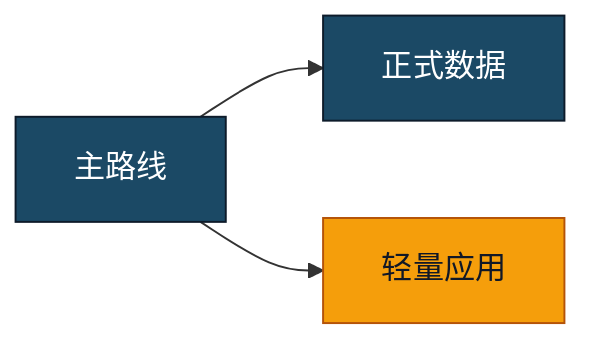

# 转换选项与高级用法

只在基础转换以外的场景读取本文件。

## CLI

```text
node convert.mjs <input.md> [output.pdf] [options]

--toc off|on|auto
--highlight auto|off
--math auto|off
--repair-markdown safe|off
--diagram auto|normal|full-page
--date-folder
--watermark <text>
--watermark-opacity <0..1>
--watermark-angle <-180..180>
--owner-password-env <environment-variable-name>
--header-footer on|off
```

`output.pdf` 一旦显式给出，优先于 `--date-folder`。所有转换使用临时 PDF 后再写入正式目标；目标被占用时回退为 `_new.pdf`。

## 代码语法高亮

`--highlight auto` 为默认值。转换器优先使用围栏信息字符串中的语言，例如 `sql`、`python`、`javascript`、`typescript`、`powershell`、`bash`、`json`、`yaml`、`java` 和 `csharp`。常见短别名如 `py`、`js`、`ts`、`ps1`、`sh`、`yml` 会先规范化。

未声明语言时，只有达到最低内容长度和识别置信度的代码块才自动着色；短片段、超大代码块和低置信度结果保持纯文本。使用 `--highlight off` 可完全关闭语法着色，但语言标签和代码内容仍保留。未知语言按纯文本渲染并在转换日志中列出。

## 可点击目录

`--toc on` 临时生成目录时，每个目录条目都会链接到对应标题。标题锚点基于可见标题文字生成，支持中文、重复标题去重和 Setext 标题。转换器在打印前检查所有文内链接目标，缺失目标会使转换失败。

生成后用以下命令验证 PDF 内部链接注释，而不只检查目录的视觉样式：

```powershell
python .\scripts\qa_pdf.py output.pdf --out-dir tmp\pdfs\qa --render all --expect-internal-links
```

`--expect-internal-links` 在没有内部链接注释时直接返回失败。若文档不存在代码块中的合法 Markdown 标记等预期警告，可再加 `--strict` 同时启用全部文本与页面门禁。

## Mermaid 图表模式

- `auto`：根据 SVG 尺寸和节点数量判断是否独占整页。
- `normal`：作为普通正文图表排版。
- `full-page`：所有 Mermaid 独占一页。
- 单图覆盖：使用 ```` ```mermaid full-page ```` 或 ```` ```mermaid normal ````。

需要区分节点颜色时使用 Mermaid 原生语法：



## 水印和加密

PowerShell 示例：

```powershell
$env:MD2PDF_OWNER_PASSWORD = '<从安全渠道取得的密码>'
node .\convert.mjs input.md output.pdf --watermark "FOX-ESS" --owner-password-env MD2PDF_OWNER_PASSWORD
Remove-Item Env:MD2PDF_OWNER_PASSWORD
```

密码通过环境变量传入，避免出现在进程参数和命令历史中。默认允许打印和复制，但禁止普通阅读器修改、批注、表单填写和页面重组。

## 页面质检

使用 Codex 工作区依赖中提供的 Python：

```powershell
python .\scripts\qa_pdf.py output.pdf --out-dir tmp\pdfs\qa --render all
```

`qa_pdf.py` 会生成 JSON 报告、页面 PNG 和联系表。原始 Markdown 或 LaTeX 标记可能合法存在于代码块中，因此报告中的 raw-marker 警告必须结合页面和源文档判断，不能机械认定为失败。

## 常见失败

- Mermaid 数量不一致：检查出错图表，不能跳过后交付。
- KaTeX 解析失败：修复临时副本中的公式，保留源文件。
- 图片加载失败：检查相对路径；转换器只允许读取 Markdown 所在目录及其子目录。
- 输出被占用：关闭阅读器后重新生成正式文件；若先产生 `_new.pdf`，明确告诉用户实际路径。
- 页面异常留白：检查整页 Mermaid、超长表格、代码块和手工分页提示，调整布局后重新质检。
